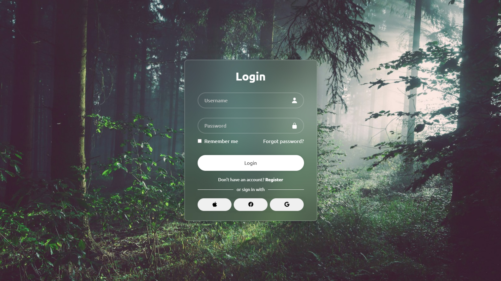

<h1 align="center"> Login Page - Projeto Front-End </h1>

 Projeto de página de login desenvolvido com HTML e CSS, baseado em um vídeo do canal DevClub no Youtube. Fiz algumas personalizações, como adição de botões sociais e alterações do plano de fundo. 

    

## ✨ Funcionalidades
- Página de login estilizada com CSS
- Botões de login social (Apple, Facebook e Google)
- Plano de fundo personalizado
- Design centralizado
- Estilização com efeitos suaves com o hover

## 🚀 Tecnologias
Esse projeto foi desenvolvido com as seguintes tecnologias:

- HTML e CSS
- Git e Github

## 🧠 Aprendizados
Este projeto foi construido acompanhando uma videoaula do DevClub, e me ajudou a reforçar:
- Estrutura básica de uma interface de login
- Estilização com flexbox
- Uso de Icons
- Customização de estilos com hover

## 💻 Projeto
- [Acesse o projeto finalizado, online](https://login-fernanda.netlify.app/)

---

Feito por Fernanda Bortoletto